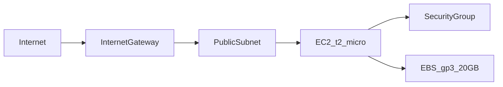

# DevOps Demo — API Minimalista com CI/CD Custo Zero

API FastAPI de demonstração com pipeline completo de Integração e Entrega Contínua, utilizando exclusivamente recursos gratuitos da AWS (Free Tier) e do GitHub.

**Repositório:** `https://github.com/<SEU_USUARIO>/devops`

---

## Objetivos

- Demonstrar uma esteira DevOps profissional de ponta a ponta
- Manter **custo zero absoluto** dentro dos limites do AWS Free Tier e GitHub
- Automatizar build, testes, publicação de imagem Docker e deploy em EC2

---

## API Minimalista

| Endpoint | Método | Resposta |
|----------|--------|----------|
| `/`      | GET    | `{"status": "OK", "message": "Hello World"}` |

**Stack:** Python 3.12 · FastAPI · Uvicorn · Porta `8000`

---

## Requisitos

| Ferramenta    | Versão mínima |
|---------------|---------------|
| Python        | 3.12          |
| Docker        | 24+           |
| Docker Compose| v2            |
| Terraform     | 1.5+          |
| AWS CLI       | 2.x           |
| Conta AWS     | Free Tier ativo |
| Conta GitHub  | Repositório com Actions habilitado |

---

## Execução Local

### Com Docker Compose

```bash
docker compose up --build
curl http://localhost:8000/
```

### Com Python (desenvolvimento)

```bash
python -m venv .venv
source .venv/bin/activate        # Linux/macOS
# .venv\Scripts\activate         # Windows
pip install -r requirements.txt
uvicorn app.main:app --reload --port 8000
```

### Testes e Lint

```bash
pip install -r requirements.txt
ruff check app/ tests/
pytest tests/ -v
```

---

## Plano de Integração Contínua (CI)

O workflow [`.github/workflows/deploy.yml`](.github/workflows/deploy.yml) executa automaticamente a cada push na branch `main`:


| Etapa | Ferramenta | Descrição |
|-------|-----------|-----------|
| 1. Checkout | `actions/checkout` | Clona o repositório |
| 2. Setup | `actions/setup-python` | Instala Python 3.12 com cache pip |
| 3. Lint | Ruff | Valida estilo e erros estáticos em `app/` e `tests/` |
| 4. Test | Pytest + httpx | Executa testes da rota `/` |
| 5. Build | Docker | Constrói imagem otimizada (python:3.12-slim) |
| 6. Push | GHCR | Publica em `ghcr.io/<owner>/<repo>:latest` |

---

## Especificação da Infraestrutura (IaC)

A infraestrutura está definida em [`infra/`](infra/) com Terraform e segue rigorosamente a política de **custo zero**:



### Recursos provisionados

| Recurso | Configuração | Justificativa |
|---------|-------------|---------------|
| VPC | `10.0.0.0/16` com DNS | Rede isolada mínima |
| Subnet pública | `10.0.1.0/24`, IP público automático | Acesso direto sem NAT Gateway (custo) |
| Internet Gateway | Rota `0.0.0.0/0` | Conectividade externa |
| EC2 | `t2.micro` (us-east-1) | 750 h/mês gratuitas no Free Tier |
| EBS | `gp3`, 20 GB, criptografado | Dentro dos 30 GB gratuitos |
| Security Group | Portas 22 (SSH) e 8000 (app) | Mínimo necessário |
| Key Pair | Chave SSH do operador | Acesso seguro para deploy |

### Recursos **não** provisionados (evitar custos)

- Application Load Balancer (ALB) — ~$16/mês
- NAT Gateway — ~$32/mês + tráfego
- Subnets privadas — exigiriam NAT Gateway
- Elastic IP — custo se não associado a instância running
- AWS ECR — GHCR é gratuito com GitHub

### Provisionamento

```bash
cd infra
cp terraform.tfvars.example terraform.tfvars
# Edite terraform.tfvars com sua chave SSH e IP público

terraform init
terraform plan
terraform apply

# Anote o output public_ip para configurar o secret EC2_HOST
terraform output public_ip
```

---

## Entrega Contínua (CD)

Após o CI, o job `deploy` conecta via SSH na EC2 e atualiza o container:

1. Autentica no GHCR com Personal Access Token
2. Faz `docker pull` da imagem `:latest`
3. Para e remove o container anterior
4. Inicia novo container mapeando porta `8000`
5. Valida com healthcheck HTTP

### Secrets GitHub necessários

Configure em **Settings → Secrets and variables → Actions**:

| Secret | Descrição |
|--------|-----------|
| `EC2_HOST` | IP público da instância (output `public_ip` do Terraform) |
| `EC2_SSH_KEY` | Conteúdo completo da chave privada `.pem` |
| `GHCR_USERNAME` | Seu usuário GitHub (owner do pacote) |
| `GHCR_PAT` | Personal Access Token com permissão `read:packages` |

> **Alternativa:** torne o pacote GHCR **público** (Settings do pacote → Change visibility) e remova a necessidade de `GHCR_PAT` no deploy, usando pull anônimo.

### Gerar chave SSH

```bash
ssh-keygen -t ed25519 -f devops-key -C "devops-deploy"
# public_key  → terraform.tfvars
# devops-key  → secret EC2_SSH_KEY
```

---

## Estrutura do Projeto

```
devops/
├── app/
│   └── main.py                 # API FastAPI
├── tests/
│   └── test_main.py            # Testes automatizados
├── infra/
│   ├── main.tf                 # Recursos AWS
│   ├── variables.tf            # Variáveis Terraform
│   ├── outputs.tf              # Outputs (public_ip)
│   └── terraform.tfvars.example
├── .github/workflows/
│   └── deploy.yml              # Pipeline CI/CD
├── Dockerfile
├── .dockerignore
├── docker-compose.yml
├── requirements.txt
├── README.md
└── RELATORIO_FINAL.md
```

---

## Estimativa de Custo

| Serviço | Custo mensal (Free Tier) |
|---------|--------------------------|
| EC2 t2.micro (750 h) | $0 |
| EBS gp3 20 GB | $0 |
| GitHub Actions (repo público) | $0 |
| GHCR (500 MB storage) | $0 |
| **Total** | **$0/mês** |

> Após 12 meses de Free Tier ou excedendo limites, a instância t2.micro custa aproximadamente $8–10/mês.

---

## Licença

Projeto de demonstração — uso livre para fins educacionais.
