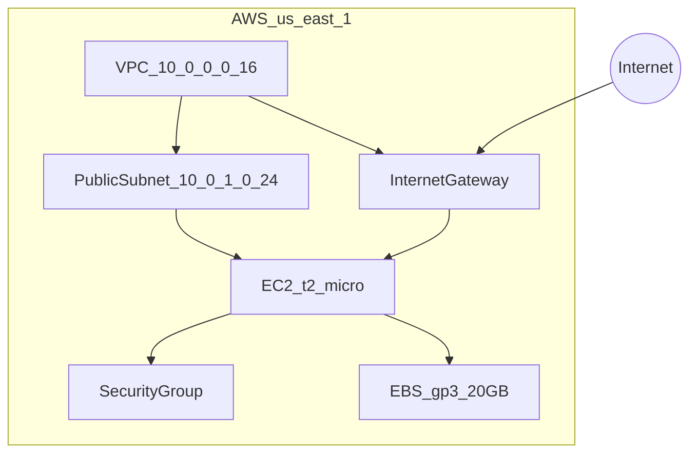
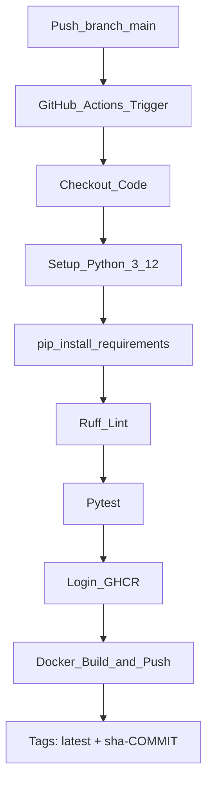
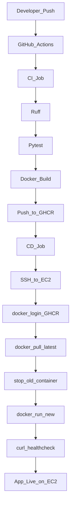

# Relatório Final — Esteira DevOps Custo Zero

Documentação completa da implementação da pipeline DevOps para a API minimalista FastAPI, com foco em custo zero absoluto utilizando AWS Free Tier e GitHub.

---

## 1. Aplicação Minimalista

### Objetivo
Criar uma API HTTP simples que sirva exclusivamente como artefato de deploy, mantendo o código limpo e testável.

### Implementação
- **Framework:** FastAPI 0.115
- **Servidor:** Uvicorn (ASGI)
- **Rota:** `GET /` retorna `{"status": "OK", "message": "Hello World"}`
- **Arquivo principal:** [`app/main.py`](app/main.py)
- **Testes:** [`tests/test_main.py`](tests/test_main.py) com `TestClient` do FastAPI

### Resultado
API funcional em menos de 15 linhas de código, com cobertura de teste para a rota principal. Porta padronizada em `8000` para consistência entre ambientes local, Docker e EC2.

---

## 2. Containerização

### Objetivo
Empacotar a aplicação em container leve, reprodutível e pronto para deploy automatizado.

### Implementação

| Arquivo | Descrição |
|---------|-----------|
| [`Dockerfile`](Dockerfile) | Multi-stage build com `python:3.12-slim`, usuário não-root, HEALTHCHECK |
| [`.dockerignore`](.dockerignore) | Exclui infra, testes, docs e arquivos sensíveis do contexto de build |
| [`docker-compose.yml`](docker-compose.yml) | Orquestração local com healthcheck e restart policy |

### Decisões técnicas
- **Imagem base `slim`** em vez de `alpine`: melhor compatibilidade com wheels Python nativos
- **Multi-stage build:** separa instalação de dependências da imagem final, reduzindo tamanho
- **Usuário não-root (`appuser`):** princípio de least privilege
- **HEALTHCHECK integrado:** permite monitoramento básico do container

### Resultado
Imagem Docker otimizada (~150 MB) executável localmente com `docker compose up --build`.

---

## 3. Infraestrutura como Código (Terraform)

### Objetivo
Provisionar infraestrutura AWS reprodutível, versionada e dentro do Free Tier.

### Implementação
Arquivos em [`infra/`](infra/):

- **`main.tf`** — VPC, subnet pública, IGW, route table, security group, key pair, EC2
- **`variables.tf`** — parâmetros configuráveis (região, tipo de instância, chave SSH)
- **`outputs.tf`** — IP público, instance ID, comando SSH de exemplo
- **`terraform.tfvars.example`** — template para configuração do operador

### Arquitetura provisionada

### Bootstrap da EC2 (user_data)
Script de inicialização instala Docker via `dnf` no Amazon Linux 2023 e adiciona `ec2-user` ao grupo `docker`, preparando a instância para receber containers via pipeline.

### Restrições de custo aplicadas
- Sem ALB, NAT Gateway, subnets privadas ou Elastic IP
- Instância `t2.micro` (750 horas/mês gratuitas)
- Volume `gp3` de 20 GB (dentro dos 30 GB gratuitos)
- IP público efêmero da subnet (sem custo adicional)

### Resultado
Infraestrutura completa provisionável com três comandos: `terraform init`, `plan`, `apply`.

---

## 4. Pipeline de Integração Contínua (CI)

### Objetivo
Validar qualidade do código e publicar imagem Docker automaticamente a cada push em `main`.

### Implementação
Workflow: [`.github/workflows/deploy.yml`](.github/workflows/deploy.yml)

### Fluxo CI

### Etapas detalhadas

1. **Checkout** — clona o repositório no runner Ubuntu
2. **Setup Python 3.12** — com cache de dependências pip
3. **Ruff Lint** — análise estática de `app/` e `tests/`
4. **Pytest** — execução dos testes automatizados
5. **Docker Build** — constrói imagem a partir do Dockerfile
6. **Push GHCR** — publica em `ghcr.io/<owner>/<repo>` usando `GITHUB_TOKEN` nativo (sem custo de ECR)

### Resultado
Cada push em `main` gera uma imagem Docker versionada e disponível no GitHub Container Registry em ~2–3 minutos.

---

## 5. Pipeline de Entrega Contínua (CD)

### Objetivo
Deploy automatizado na EC2 via SSH, sem serviços gerenciados adicionais.

### Fluxo CD completo

### Etapas de deploy na EC2

1. Conexão SSH com chave privada (secret `EC2_SSH_KEY`)
2. Autenticação no GHCR com PAT (secret `GHCR_PAT`)
3. Pull da imagem `:latest`
4. Stop/remove do container anterior (`devops-api`)
5. Run do novo container com `--restart unless-stopped` e mapeamento `-p 8000:8000`
6. Healthcheck via `curl http://localhost:8000/`

### Secrets utilizados

| Secret | Origem |
|--------|--------|
| `EC2_HOST` | Output `public_ip` do Terraform |
| `EC2_SSH_KEY` | Chave privada gerada com `ssh-keygen` |
| `GHCR_USERNAME` | Usuário GitHub |
| `GHCR_PAT` | Personal Access Token com `read:packages` |

### Resultado
Deploy zero-downtime aproximado (downtime de ~5 segundos durante troca de container) sem necessidade de ALB ou serviço de orquestração.

---

## 6. Análise de Resultados

### Pontos positivos
- **Custo zero comprovado:** nenhum serviço pago utilizado dentro dos limites Free Tier
- **Pipeline completa:** do commit ao deploy em produção sem intervenção manual
- **Reprodutibilidade:** Terraform + Docker garantem ambientes idênticos
- **Simplicidade operacional:** uma EC2, um container, um workflow

### Trade-offs aceitos
| Trade-off | Impacto | Mitigação futura |
|-----------|---------|------------------|
| IP público efêmero | IP muda se EC2 for recriada | Elastic IP + Route53 |
| Porta 8000 aberta ao mundo | Superfície de ataque exposta | Restringir SG ou adicionar reverse proxy |
| Deploy via SSH | Sem rollback automático | Blue/green com dois containers ou ECS |
| Sem monitoramento | Falhas silenciosas | Prometheus/Grafana ou CloudWatch |

### Tempo estimado de execução
| Fase | Duração |
|------|---------|
| CI (lint + test + build) | ~2 min |
| CD (SSH + pull + run) | ~1 min |
| **Total push-to-deploy** | **~3 min** |

---

## 7. Sugestões Futuras

### 1. Estabilidade de endpoint — Elastic IP + Route53
Associar um Elastic IP à instância EC2 e configurar um registro DNS no Route53 (`api.seudominio.com`). Elimina a necessidade de atualizar o secret `EC2_HOST` a cada recriação da instância. Custo do Elastic IP: gratuito enquanto associado a instância running; Route53 hosted zone: ~$0.50/mês.

### 2. Monitoramento — Prometheus + Grafana (ou CloudWatch Agent)
Implementar stack de observabilidade:
- **Prometheus** coletando métricas do container via cAdvisor
- **Grafana** com dashboards de CPU, memória, latência e uptime
- Alternativa AWS-native: **CloudWatch Agent** na EC2 (gratuito no Free Tier para métricas básicas)

Benefícios: alertas proativos, histórico de performance, detecção de falhas antes do usuário.

### 3. Escalabilidade — Migração para ECS Fargate + ALB
Quando o projeto ganhar escala e orçamento:
- Migrar de EC2 single-instance para **ECS Fargate** (serverless containers)
- Adicionar **Application Load Balancer** para distribuição de tráfego
- Implementar **auto-scaling** baseado em CPU/requisições
- Usar **AWS ECR** como registry privado integrado

Estimativa de custo inicial ECS Fargate: ~$15–30/mês (0.25 vCPU, 0.5 GB RAM, 1 task).

---

## Conclusão

A esteira DevOps implementada cobre todas as fases do ciclo de vida de software — desenvolvimento, testes, build, publicação e deploy — utilizando exclusivamente recursos gratuitos. A arquitetura é intencionalmente simples para demonstração, mas segue práticas profissionais (IaC, containerização, CI/CD automatizado, testes, lint) que servem como base sólida para evolução conforme o projeto cresça.
